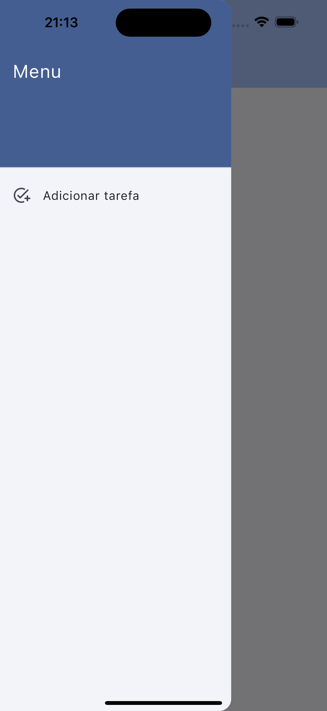

# Projeto para a disciplina "[24E2_3] Integrações e Publicação de Apps Flutter"

Este projeto foi desenvolvido como parte da disciplina "[24E2_3] Integrações e Publicação de Apps Flutter". O objetivo do projeto é criar um aplicativo de tarefas que permite adicionar, visualizar e gerenciar tarefas.

## Funcionalidades

- Adicionar uma nova tarefa
- Visualizar detalhes de uma tarefa
- Editar uma tarefa existente
- Excluir uma tarefa
- Listar todas as tarefas

## Capturas de Tela

### Login

### Registro

### Home listagem

### Adicionar Tarefa

### Home listagem nova tarefa 

### Integrações

